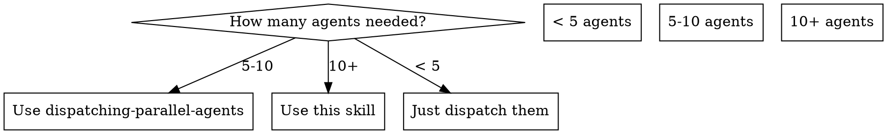

# Scaled Agent Orchestration

## Overview

Run 30+ agents without blowing context. Workers write to disk, coordinators synthesize, parent receives only brief summaries.

**Core principle:** Never let more than 5 agent results flow into one context window. Use files as the communication bus.

## When to Use



**Use when:**
- Need 10+ parallel agents
- Previously hit "Conversation too long" or compaction errors
- Work decomposes into independent domains with sub-tasks

**Don't use when:**
- < 10 agents needed (use dispatching-parallel-agents)
- Tasks are tightly coupled (use subagent-driven-development)
- Sequential dependency chain (agents need each other's output)

## The Architecture

```
Parent context (receives ~5 short summaries)
├── Coordinator A (reads worker files, returns 1 paragraph)
│   ├── Worker A1 → /tmp/orchestration/{run}/workers/a1.md
│   ├── Worker A2 → /tmp/orchestration/{run}/workers/a2.md
│   └── Worker A3 → /tmp/orchestration/{run}/workers/a3.md
├── Coordinator B
│   ├── Worker B1 → /tmp/orchestration/{run}/workers/b1.md
│   └── Worker B2 → /tmp/orchestration/{run}/workers/b2.md
└── Coordinator C
    └── ...
```

## The Process

### 1. Setup output directory

```bash
RUN_ID=$(date +%Y%m%d-%H%M%S)
mkdir -p /tmp/orchestration/$RUN_ID/{workers,synthesis}
```

### 2. Decompose into domains

Group work into 3-5 coordinator domains. Each domain gets 3-8 workers.

### 3. Dispatch workers (background, wave by wave)

All workers in a coordinator's domain can run in parallel. Use `run_in_background: true`. Each worker prompt MUST include:

- Specific narrow task
- Output file path
- Instruction to return ONLY "Done. {one sentence}" to parent

See `./worker-prompt.md` for template.

### 4. Dispatch coordinators (after workers finish)

Each coordinator reads its workers' output files and writes a synthesis. Returns only a brief summary to parent.

See `./coordinator-prompt.md` for template.

### 5. Parent decides next action

Parent has 3-5 coordinator summaries (small context cost). Full details on disk if needed.

## Wave Strategy

For 30+ agents, batch workers in waves of 8:

```
Wave 1: Workers A1-A4, B1-B4 (background) → finish
Wave 2: Workers A5-A8, C1-C4 (background) → finish
Wave 3: Coordinators A, B, C (foreground) → summaries to parent
Wave 4: Action agents based on findings
```

## Token Budget

| Component | Context cost to parent |
|-----------|----------------------|
| 1 worker (background, file output) | ~20 tokens ("Done. Found 3 issues.") |
| 1 coordinator summary | ~200 tokens |
| 30 workers + 4 coordinators | ~1,400 tokens total |
| 30 agents flat (anti-pattern) | ~150,000 tokens (context death) |

## Red Flags - STOP

- Spawning 10+ agents without file-based output
- Workers returning verbose results to parent
- Skipping coordinator layer (flat fan-out at scale)
- All agents in foreground (use background for workers)
- No output directory setup before dispatching

## Common Mistakes

**Workers return full results:** Tell workers to write to file. Return only "Done. {summary}."

**Too many coordinators:** 3-5 is the sweet spot. More defeats the purpose.

**No wave batching:** 30 simultaneous background agents can still strain the system. Batch 8 at a time.

**Coordinators read wrong files:** Use explicit paths. Don't rely on glob patterns in prompts.

## Integration

- **superpowers:dispatching-parallel-agents** — Use for the worker-level dispatch within each coordinator domain
- **superpowers:subagent-driven-development** — Use when tasks are sequential, not parallel
